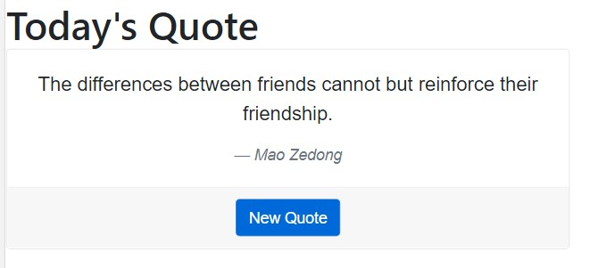

# Display Quote

## Table of content

- [Description](#description)
- [How to Run the Application](#about)
- [Future Improvements](#future-mprovement)
- [License](#license)
- [Demo](#demo)

## Description
This is a simple React application which goes out to the <b><i>quotable.io</i></b> server and brings in random quotes based on clicking on a New Quote button.

## Setting Up and Running The Application

### About
This application is made up of 3 main files
  - <b>styles.css</b> which includes the styles for the general App card element
  - <b>index.html</b> which includes the linked css and js source libraries as well as the React component fetchSaying.jsx
  - <b>fetchSaying.jsx</b> contains the App Quote Card component with functions including the call out to server to get a new quote.  This is triggered at the beginning of the App function and through the New Quote button.

### Running the Application
 (1) You can download these 3 files to a directory on your local drive.  
 (2) Once installed in a directory, run an http-server from the directory and identify the ip/port number used
 (3) Open your browser and enter <ip>:<port>/index.html from input line
 
### Future Improvements
•	 Cleaned up the UI to include a select input to enter whether the user wants to Deposit $$ or get Cash Back.   Based on this choice, added code to only amount input if a valid option was chosen.  Also included access to the resulting value through React hook useState and either decrement or increment the bank account amount.
•	 Included validation logic to prevent Cash Back withdrawals greater than what is available in the Account.  This includes having the Submit button deactivated if the input value is not valid.
•	 Added additional style to the elements to make them easier to view and read (e.g. the select option element was shorter then the entry values).

## License

MIT License

Copyright (c) 2022
Permission is hereby granted, free of charge, to any person obtaining a copy of this software and associated documentation files (the "Software"), to deal in the Software without restriction, including without limitation the rights to use, copy, modify, merge, publish, distribute, sublicense, and/or sell copies of the Software, and to permit persons to whom the Software is furnished to do so, subject to the following conditions:

The above copyright notice and this permission notice shall be included in all copies or substantial portions of the Software.

THE SOFTWARE IS PROVIDED "AS IS", WITHOUT WARRANTY OF ANY KIND, EXPRESS OR IMPLIED, INCLUDING BUT NOT LIMITED TO THE WARRANTIES OF MERCHANTABILITY, FITNESS FOR A PARTICULAR PURPOSE AND NONINFRINGEMENT. IN NO EVENT SHALL THE AUTHORS OR COPYRIGHT HOLDERS BE LIABLE FOR ANY CLAIM, DAMAGES OR OTHER LIABILITY, WHETHER IN AN ACTION OF CONTRACT, TORT OR OTHERWISE, ARISING FROM, OUT OF OR IN CONNECTION WITH THE SOFTWARE OR THE USE OR OTHER DEALINGS IN THE SOFTWARE.

## Demo

* [Quote Demo](https://pamelaarcher.github.io/saying)
